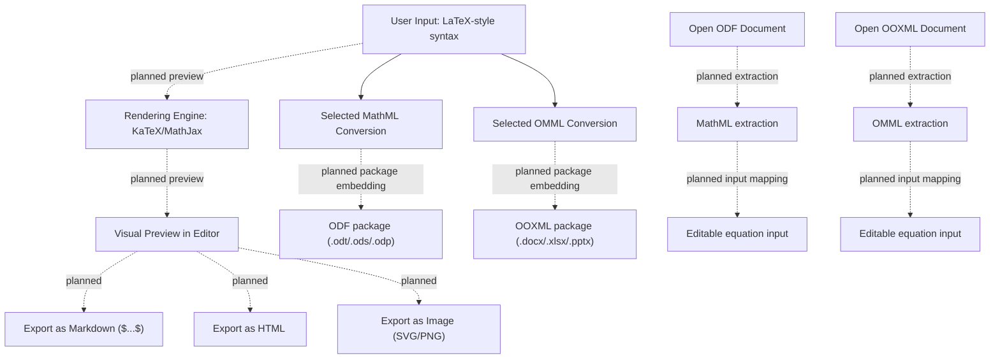

# Papirus Office

## 📘 Application Name
**Papirus Office** – An Android-first, modular, open-source office suite built around LibreOffice technologies and APIs where available, with ODF as a first-class format and practical OOXML compatibility as a goal. Its design adapts capable office workflows to phones, foldables and tablets.

---

## 📝 Short Description
Papirus Office is an Android-first, modular office suite built around LibreOffice technologies and APIs where available, with Material 3 Expressive as its UI foundation. It aims to make capable document editing practical on phones, foldables and tablets. ODF is a first-class format and OOXML compatibility is a goal; actual coverage is feature- and test-dependent. This is not a claim of complete LibreOffice API integration or full format parity.

---

## 📊 Current Status
- **Phase 1**: Environment setup ✅  
- **Phase 2**: JNI implementation & stress test stage 1 ✅
- **Phase 3**: Building LibreOffice core engine & stress test stage 2 🔜  
- **Phase 4**: Core editing & UI implementation (Material 3 Expressive) – *in progress*  
- **Phase 5**: ARM optimization – *planned*  
- **Phase 6**: Low-end device testing – *planned*  
- **Phase 7**: Adding PC-level features gradually – *planned*

This readme file will be used for development purpose.

---

## 🎨 Hybrid Experience Design (binding direction)

`DESIGN.md` is the authoritative design specification. The reference map below is scoped by surface and must be adapted to Material 3 Expressive, Papirus branding, Android accessibility and responsive layouts; it is not a pixel-copy instruction.

| Product surface | Reference pattern |
|---|---|
| Start Screen, all tabs | Google Workspace apps |
| Editor dialogs across Inky, Cellina, Slidia and Pagella | Google Workspace apps |
| Welcome Screen and Create New Documents | WPS Office |
| Options, Crash Logs and About | Android system settings; About sections use accessible vertical page navigation/transition |
| Editor screens | M365 Copilot mobile office |
| Standard Bottom Sheet command deck | Microsoft Office 365 for Inky/Cellina/Slidia; SoftMaker FlexiPDF for Pagella |
| General office layout and document concepts | LibreOffice, adapted to Android touch and adaptive screen sizes |

The app uses Material Symbols Rounded by default. The repository's `app/src/main/share/config/images_colibre.zip` is a candidate optional Colibre set pending provenance and license review. Google Sans is the intended UI family; Roboto/system sans-serif remains the reliability fallback until device rendering is validated. App UI fonts must never replace a document's font/style identity.

### Palette behavior

- Android 12+ defaults to Android's system dynamic color scheme (which may be derived from wallpaper colors by the OS).
- Android 11 and below use Papirus static light/dark schemes and the established suite/module accents.
- User-selected custom colors and a Papirus palette derived from system wallpaper colors are separate options. Read wallpaper color input independently (for example, `WallpaperManager.getWallpaperColors` where available) and generate Papirus's own scheme; do not merely re-use the Android 12+ Material system color scheme. If unavailable, offer a user-selected image through SAF or a static fallback.
- The adaptive bottom sheet may begin near 40% height on a phone, but must expand/scroll as needed; 40% is not a universal fixed limit.

Implementation and PR sequencing are in `anti-slop/plan-11-hybrid-experience-design.md`.

---

## 🔗 Links used:
- LibreOffice Gerrit:
  - Main repo: https://gerrit.libreoffice.org/
  - Alternative: https://github.com/LibreOffice/core
- Collabora Online GitHub: https://github.com/CollaboraOnline/online
- HarfBuzz: https://github.com/harfbuzz/harfbuzz
- Microsoft OpenXML SDK Documentation: https://learn.microsoft.com/en-us/office/open-xml/open-xml-sdk
- OpenXML SDK Repository: https://github.com/dotnet/Open-XML-SDK
- ECMA-376 OOXML Specifications: https://ecma-international.org/publications-and-standards/standards/ecma-376/
- ZIP Container Handler (Open Packaging Conventions): https://github.com/kuba--/zip
- TinyXML Parser: https://github.com/leethomason/tinyxml2
- Material 3 Expressive Documentation: https://m3.material.io/
- Roboto Flex Font Repository: https://github.com/googlefonts/roboto-flex
- Material Symbols Repository: https://github.com/google/material-design-icons
- All repository links for creating equation syntax:
  - KaTeX: https://github.com/KaTeX/KaTeX
  - MathJax: https://github.com/mathjax/MathJax
  - LaTeXML: https://github.com/brucemiller/LaTeXML
- Mermaid Syntax Repository: https://github.com/mermaid-js/mermaid
- ScanIt: https://github.com/mishraaditya595/ScanIt
- ZXing: https://github.com/zxing/zxing
- ZBar: https://github.com/ZBar/ZBar
- All Android integration samples: https://developer.android.com/samples
- BibTeX Parser:
  - Main website: https://pypi.org/project/bibtexparser/
  - GitHub page: https://github.com/sciunto-org/python-bibtexparser
  - Documentation: https://bibtexparser.readthedocs.io
- Ink drawing support
  - API documentation: https://developer.android.com/develop/ui/views/touch-and-input/stylus-input/about-ink-api
  - Source code: https://github.com/google/ink

---

## 🧮 Modular Equation Parser Flow

`EquationParser` implements selected conversions from LaTeX-style input to MathML and OMML. In-app KaTeX/MathJax preview and writer-side package embedding/extraction are not yet complete; conversion functions alone do not make equations editable or persistent in ODT/DOCX. The pipeline below distinguishes current conversion code from target behavior.

---

### 1. Equation Input (User-Facing)
- **Input format**: LaTeX-style syntax  
  Example: `\frac{a}{b} + \sqrt{x}`  
- **Editor modules**: Writer, Calc, Impress  
- **Preview target**: KaTeX or MathJax (planned; not yet a claim of a working document equation editor)

### 2. Internal Conversion Pipeline
- From User Input → Rendered Equation
  LaTeX-style input → KaTeX/MathJax → Visual preview
- From Rendered Equation → Document Format
  Depending on the target format:
  - ODF (OpenDocument Format)
    LaTeX-style input → MathML conversion exists; ODF package embedding is not yet wired or verified.
  - OOXML (Microsoft Office Format)
    LaTeX-style input → OMML conversion exists; OOXML package embedding is not yet wired or verified.

### 3. Equation Extraction (target behavior, not yet verified)
- ODF: MathML extraction, conversion to editable input and reinsertion are not yet established as an end-to-end path.
- OOXML: OMML extraction, conversion to editable input and reinsertion are not yet established as an end-to-end path.

### 4. Equation Saving (target behavior, not yet implemented end to end)
- ODF packages should store equations using appropriate MathML structures after model/writer integration and round-trip tests.
- OOXML packages should store equations using appropriate OMML structures after model/writer integration and round-trip tests.
- Markdown, HTML and image export are optional future paths, not current guarantees.

### 5. Notes & Recommendations
- A KaTeX/MathJax preview is a target; do not claim it is wired into the editor until verified.
- MathML/OMML are format representations to validate against ODF 1.4 and ECMA-376, not by themselves a promise of full compatibility.
- Treat conversion, model integration, rendering, serialization and extraction as separate capabilities with separate tests.
- Build flags such as `ENABLE_MATHML_SUPPORT` or `ENABLE_OMML_SUPPORT` are proposals only unless present in the actual build.

### 6. Status summary
| Capability | Status |
|---|---|
| Selected LaTeX-to-MathML conversion | Implemented in parser code; format conformance is not implied. |
| Selected LaTeX-to-OMML conversion | Implemented in parser code; format conformance is not implied. |
| Visual equation editor/preview | Planned; verify before describing as shipped. |
| ODF/OOXML save and reopen | Not yet established; requires package round-trip tests. |

---
## 🧮 Modular Equation Parser Flow (Mermaid Diagram)

    
---

## 🚀 Roadmap
### 📦 LibreOffice and ODF/OOXML foundations (Phase 3)

This phase is a staged compatibility effort, not a statement that a native LibreOffice engine or complete format parity is already available. Current code contains Kotlin document parsers and a LibreOfficeKit probe/fallback path; the native C++/JNI API facade and document fidelity remain incomplete. See `PROJECT_CONTEXT.md` and the Plans 5–9 roadmap for verified status.

#### Task 1: Native LibreOfficeKit integration (planned/incomplete)
- Native libraries and a probe/fallback exist in the repository, but their presence does not establish that native Writer/Calc/Impress rendering is active.
- Complete the JNI facade and verify usable calls, device stability and memory behavior before claiming native editing/rendering.

#### Task 2: Real-world document parsing and rendering (ongoing)
- Use the actual repository corpus, including all six matched ODT/DOCX pairs in `tests/inky/`; add representative ODS/XLSX/ODP/PPTX samples as those workstreams mature.
- Record parse coverage, rendering differences, page counts, crashes and device/build evidence. Do not report a fidelity percentage without a repeatable comparison method and results.

#### Task 3: OOXML standards and SDK reference (reference material available)
- Use [Microsoft Open XML SDK documentation](https://learn.microsoft.com/en-us/office/open-xml/open-xml-sdk) and its [source repository](https://github.com/dotnet/Open-XML-SDK) as an API/package guide, with [ECMA-376](https://ecma-international.org/publications-and-standards/standards/ecma-376/) as the normative format specification.
- Cover WordprocessingML, SpreadsheetML, PresentationML and OMML according to their actual owning plans and tests.

#### Task 4: ODF/OOXML compatibility layers (partial Kotlin implementation; continued work)
- Existing parsers and writers cover selected document structures; this is not a complete C++ compatibility engine or a guarantee of lossless read/write behavior.
- Follow ODF 1.4 in `docs/html` and ECMA-376; preserve package parts/relationships and test the files in the repo before expanding feature claims.
- Plans 5–9 track metrics, image/media handling, ODF structures, DOCX styles/fields/numbering/tables/sections and save round-trip integrity.

#### Task 5: Behavioral comparison (planned and evidence-led)
- Compare against Microsoft Office or LibreOffice using documented test inputs and observable layout/behavior, never proprietary source code.
- Log discrepancies and scope fixes to public specifications and testable behavior.
- Do not use unsupported claims such as a fixed fidelity percentage without a baseline, method and recorded evidence.

The product goal is useful ODF-first editing with practical OOXML compatibility, reached through staged implementation and evidence. It is not a current guarantee of full interoperability.

---

### 🔹 Upcoming UI/UX Implementation (Phase 4)
#### 🎨 Material 3 Expressive Aesthetics
- **UI font target**: Google Sans; keep Roboto/system sans-serif as the tested fallback until on-device rendering and accessibility scaling are validated. Roboto Flex is not the current UI-family decision.
- **Icons**: Material Symbols Rounded by default. Colibre is only an optional alternative after the repository ZIP's provenance and license are checked.
- Use one coherent Papirus component/token system across toolbars, editor dialogs, settings and navigation; see the surface-specific reference map above.

#### 🛠️ Toolbars (mobile)
- **Default toolbars**: Standard + Formatting (+ Sheet toolbar in Calc)
  - Includes two persistent buttons on the right side of the standard toolbar: Show/hide keyboard and open ribbon drop-down bar.
- **Contextual toolbars**: Appear only when relevant (Table, Image, Shape/Object)  
- **For formatting toolbar**: Adjusted adaptively based on selected objects (text, table, object, etc.)  
- **Overflow handling**:  
  - If >3 toolbars (mobile) or >4 in Calc → persistent drop-down button for switching  
  - Swipe vertical gesture to switch toolbars; swipe horizontal for scrolling
- All of these toolbars can be scrolled horizontally to include all options available on each toolbar

##### 🎀 Simplified ribbon bar (mobile)
- Editor-screen hierarchy is informed by M365 Copilot/Word/Excel/PowerPoint on Android, adapted to Papirus and Material 3 Expressive. This is a task-pattern reference, not a promise of Microsoft Copilot integration or identical UI.
- Can be invoked by tapping on "Open simplified ribbon bar" icon.
  - This action will also hide all toolbars.
  - Closing the simplified ribbon bar will showing these toolbars again.
- Header layout of this bar include: `Ribbon options (with inverted triangle icon)` on the left and three buttons `Undo | Redo | Hide simplified ribbon bar` on the right.
  - Tapping on `Ribbon options` will show all ribbon options in one drop-down menu:
    - File
    - Home
    - Insert
    - Design (Impress only)
    - Layout (Writer & Calc only)
    - Formula (Calc only)
    - Data (Calc only)
    - Review (Writer & Calc Only)
    - Transition (Impress only)
    - Animation (Impress only)
    - Slide show (Impress only)
    - View
    - Drawing (visible only when editing document in drawing mode)
    - Object (visible when editing any object)
    - Picture (visible when editing picture object)
    - Table (visible when editing table object)
    - Fontwork (visible when editing Fontwork object)
    - PivotTable (visible when editing PivotTable object, Calc only)
    - Chart (visible when editing chart object)
- All options in each Ribbon options are arranged in a horizontal list or grid layout dynamically.
  
#### 🎀 Ribbon full view (tablet)
- **Use full ribbon tab bar experience** like in M365 Copilot:
  - Ribbon can be minimized by double tapping on one of its tab or by clicking "^ Hide ribbon" on the far right side of the ribbon.
  - Tabs included:
    - File
    - Home
    - Insert
    - Design (Impress only)
    - Layout (Writer & Calc only)
    - Formula (Calc only)
    - Data (Calc only)
    - Review (Writer & Calc Only)
    - Transition (Impress only)
    - Animation (Impress only)
    - Slide show (Impress only)
    - View
    - Drawing (visible only when editing document in drawing mode)
    - Object (visible when editing any object)
    - Picture (visible when editing picture object)
    - Table (visible when editing table object)
    - Fontwork (visible when editing Fontwork object)
    - PivotTable (visible when editing PivotTable object, Calc only)
    - Chart (visible when editing chart object)

#### 📊 PivotTable Bar (Calc)
- On mobile, this bar will be displayed at the bottom like Ribbon drop-down bar.
- On tablet, this bar will be displayed as sidebar on the left/right side.

#### 🌟 Animations bar (Impress)
- Same as PivotTable bar above, with an addition of animation timeline with Material 3 Expressive UI style

#### 🧮 Floating Contextual Toolbar (FCT)
- This bar will be displayed on top of selected text, cell, or objects.
- Rightmost icon always opens full contextual menu (desktop-like right-click options) under the name `More options`
- **Calc**:  
  - Single cell/range: Cut, Copy, Paste, Delete, Comment, Fill mode, Multi-selection, More options  
  - Multi-range: Clear selection, Delete, Comment, Fill mode, More options (Cut/Copy/Paste hidden)  
- **Writer/Impress**:
  - Normal text: Cut, Copy, Paste, Delete, More options
  - Chart: Cut, Copy, Paste, Delete, Edit data, More options  
  - Text with spelling/grammar error: Suggestions, Delete, Ignore, More options (Cut/Copy/Paste hidden)
  - Table: Cut, Copy, Paste, Insert (Columns, rows), Delete (Columns, rows, table), Table settings, More options.
- **All modules (objects)**: AI options (if enabled), Cut, Copy, Paste, Duplicate, Delete, Add text, Properties
- **Visual grouping**: Thin separators between option groups  
- **Gestures**:  
  - Tap once (Calc cell) / double-tap (text/objects) → show FCT  
  - Long-press → open context menu  

#### 📂 Quick Access Toolbar (QAT)
- **Mobile**: Up to 3 icons visible; overflow menu (inverted triangle icon) for extras  
- **Tablet**: Default 7 icons, expandable to 10; overflow menu (inverted triangle icon) for >10 icons  
- **Tooltips**: Long-press any icon shows tooltip  

#### 🔍 Find & Replace
- **Mobile**: Replaces Title bar with scrollable toolbar; persistent icons for More options & Exit  
- **Tablet**: Full toolbar below Ribbon full view bar  

#### 🪟 Dialogs & Sidebars
- **All Editor dialogs (all modules)**: Google Workspace-inspired task hierarchy using shared Papirus/M3 components. Choose full-page, sheet or alert presentation based on task scope; do not force every dialog into one size.
- **Mobile**: Full-page dialogs where task complexity warrants them, with header layout:
  - `← Back | Title` (left), `Apply/OK/Set | ⋮ More options` (right)
  - Preview shown at top if available  
- **Tablet**: Sidebar dialogs with header:  
  - `Title` (left), ` ⋮ More options | × Close` (right)
  - Footer buttons (Apply, OK/Set, Cancel) shown dynamically  
  - Papirus Options (based on LibreOffice Options) → full-page dual-column (Android Settings style)

#### 🧠 Multi-Selection
- **Writer**: Use LibreOffice Writer's Text Selection Mode → swipe non-contiguous text  
- **Calc**: Multi-range selection via FCT  
- **All modules**: Object Mode → select multiple objects by tap or drag  
- **Feedback**:  
  - Mobile: persistent info bar/snackbar  
  - Calc: information bar (Sum, Avg, Count, etc.)  
  - Tablet: status bar  

#### 🎞️ Global Transitions
- Slide-in animations for all UI elements  
- Predictive back gesture support  

---

### 🔹 Upcoming Feature Implementation (Phase 7)
#### 🧩 General Features (All Modules)
- Start Center → Compose UI + SAF / Android Documents UI  
- Localization → LibreOffice core + English fallback  
- RTL & complex scripts → HarfBuzz
- Asian typography scripts support
- Spell check → Hunspell + LanguageTool (extra languages downloadable)  
- Font management → Google Fonts (on-demand) + `/storage/emulated/0/Fonts`
  - Option to include system fonts in font list.
  - If requested font not available, fallback to system default font or Noto Sans/Serif/Mono
- Speech-to-Text → Android API  
- Text-to-Speech (TTS) → Android TTS API  
- Sharing → Android Share Sheet  
- Undo/redo  
- Auto-correct & auto-capitalization  
- Hyperlink insertion  
- Image insertion (JPG, JPEG, GIF, PNG, SVG, WEBP, TIFF)
  - Support for inserting AI-generated image via optional AI integration feature
- Insert picture from Camera → via Android Intent  
- Text direction (LTR/RTL)  
- Slide show mode → fullscreen Activity (Impress)
- Export documents → PDF, HTML, Markdown, ePub
- Stylus ink drawing → stored as PNG images
- Shape insertion → available in Writer, Calc, Impress (subset of Draw module)
- Report bug feature → to report incoming crash via notification or to open an issue in Papirus's GitHub issues page
- About app page (on Papirus Options) must include all license terms from all source code used in this project.

---

#### 🟢 Basic Features
✍️ **Writer**
- Full basic text formatting features: bold, italic, underline, strikethrough, etc. 
- Alignment: left, center, right, justify  
- Bullet & numbered lists  
- Full page/paragraph styles & formatting features (heading, paragraph, character, etc.)
  - Advanced page formatting: page borders, watermark (with custom watermark support)
  - Advanced paragraph formatting: Drop cap, default & custom tab width
- Additional `Tab` icon option on the leftmost of the Standard toolbar to insert tab (in mobile)
- Table insertion & basic table formatting  
- Page layout: margins, orientation, size, etc.
- Header & footer  
- Page numbering  
- Find & replace

📊 **Calc**
- Full cell formatting: Number, Alignment, Font, Borders, Shading (pattern + color), Protection, Asian Typography. 
- Cell/range references: relative & absolute
  - To change the cell reference:
    - Tap on the highlighted cell/range
    - Choose the `Reference type` option
    - Choose between `A1` (all relative), `$A1` (absolute in column), `A$1` (absolute in row), or `$A$1` (all absolute)
  - Alternative method: Use F4 key (when the app is detected that a hardware keyboard is connected) to change the reference
- Automatically highlighting cell/range references when typing any formula/function with different colors
  - Tapping on the highlighted cell/range will open the 2-options Floating Contextual Toolbar (FCT):
    - `Edit`: to edit the cell/range reference
    - `Reference type`: to change it's reference type (see above)
- Sheet navigation & multiple sheets
  - For navigating the sheet in mobile:
    - Add the `Sheet tab` icon option on the leftmost of the Standard toolbar for easier access
    - When this option is clicked, the Formula toolbar will be replaced with the Sheet toolbar
    - Tapping the `Sheet tab` icon again when the Sheet toolbar is active will replacing back the Sheet toolbar with the Formula toolbar
- Cell navigation in mobile:
  - Add two additional button on the leftmost of the Standard toolbar (at the left side of the `Show/hide Sheet Toolbar` option described above):
    - `←` (Previous cell; equivalent by pressing `Shift`+`Tab` on the keyboard)
    - `→` (Next cell; equivalent by pressing `Tab` on the keyboard)
- Sorting & filtering  
- Freeze rows/columns  
- Cell merging  
- Conditional formatting (basic rules)
  - Support for adding custom conditional formatting rules
- Data validation (dropdown lists)  
- Basic charts: bar, line, pie  
- Full Calc formula support (500+ functions, integrated from LibreOffice source code)
  - Added `LibreOffice unique formulas` category for unique LibreOffice-only formulas.

🎞️ **Impress**
- Slide creation & layout templates  
- Text formatting & bullet lists  
- Basic slide transitions  

---

#### 🟡 Intermediate Features
- Equation editor → planned end-to-end feature. Selected LaTeX-to-MathML/OMML conversion functions exist; preview, package embedding/extraction and ODF/OOXML save/reopen remain unverified.
  - See: Modular Equation Parser Flow (above) for the implementation boundary and targets.
- Diagrams/Infographics → Mermaid.js  
  - Rendered as SVG/PNG images  
  - Mermaid syntax stored as linked comments  
  - Compatible with ODF and OOXML  
- PDF viewer + editor → LibreOffice Draw subset (basic editing)  
- Bibliography → SQLite/dBASE + BibTeX parser
  - BibTeX parser will map entries to SQLite schema (Author, Title, Year, Publisher, etc.)
- Document scanner → Scanit source code  
  - Export to DOCX, ODT, XLSX, ODS, PDF, Image  
- Font directory override → support for custom font directories beyond `/storage/emulated/0/Fonts`  
- Font download relocation → downloaded fonts from Google Fonts server redirected to `/storage/emulated/0/Fonts`  
- Font migration (retroactive) → older fonts moved to `/storage/emulated/0/Fonts` if relocation enabled  
- Slide sorter → Grid Compose (Impress)  
- Media embedding → Android Photo Picker + Media API (Impress)  
- Data import → TXT, CSV, SQLite, dBASE → converted to XLSX/ODS  
- QR code generator & scanner → ZXing + ZBar  
- Table of Contents & References → Writer (via style tagging + index generator)  
- Master Pages (Writer) & Master Slides (Impress) → full global layout support  
- Insert Image into cell (Calc) → experimental, limited via cell anchoring  
- Insert Chart (Writer & Impress) → via two available formats: Calc's basic subset module or Mermaid syntax
  - If Insert Chart via Calc is selected:
    - A full-page dialog of Calc spreadsheet is displayed, with all basic subset features.
    - After creating the data via this spreadsheet and save it, the spreadsheet will be automatically closed and the chart based on this data is created and displayed in the document.
    - User can edit the chart's data at any time by tapping on the chart object → `Edit data` (via FCT)
    - Additional chart settings can be accessed by tapping one of the chart elements (double tap to select a single value within a data series) → Simplified ribbon options `Chart` → `Edit chart element`
    - User can also convert the chart's data to Mermaid syntax format by tapping on the chart element → `More options` → `Convert to Mermaid`, or by tap and hold → `Convert to Mermaid`.
  - If Insert Chart via Mermaid is selected:
    - On mobile, the Simplified ribbon bar is replaced by the text box bar, where user can enter the mermaid syntax here.
    - On tablet, a text box sidebar displayed on the side of the app window.
    - The chart created using mermaid syntax format will be valid if the type of mermaid syntax diagram entered is appropriate. Otherwise the app will display the error box.
    - After creating the data via this syntax and save it, the bar (mobile)/sidebar (tablet) will be automatically closed and the chart based on this data is created and displayed in the document.
    - The chart created via this method will be displayed as image with it's mermaid syntax embedded as comment on the image.
    - User can edit the chart's data at any time by tapping on the chart object → `Edit data` (via FCT)
    - Option to edit the chart created with this format is not available because all the data (including it's elements) can only be added via the option `Edit data` above using mermaid syntax.
    - User can also convert the chart's data to Calc spreadsheet format by tapping on the chart element → `More options` → `Convert to spreadsheet`, or by tap and hold → `Convert to spreadsheet`.
  - The chart can be exported to device as image format (via tap on chart → `More options` → `Save as picture`, or tap and hold on the chart → `Save as picture`)
- Insert Table (Impress) → full support like Writer

---

#### 🟠 Advanced Features
- Advanced charting → LibreOffice Calc + hardware acceleration (scatter, radar, bubble)  
- 3D charts & visualization → LibreOffice Calc + hardware acceleration (subset port)  
- Custom animations → Compose + hardware acceleration (basic animations)  
- 3D transitions → Compose + hardware acceleration (cube, flip, rotate)  
- Presenter console → Chromecast / HDMI (split-screen presentation)  
- Remote control → Android Wear integration
- Track changes → Sidebar Compose  
- Picture styles/effects → Android Image Filter API  
- Diagonal borders → manual rendering (Compose)  

---

#### 🔴 Expert Features (External Integration)
- Advanced media editing → Android Intent (“Complete action using”) → redirect to external apps  
- Optional AI Integration (Google Gemini) →  
  - Disabled by default, can be enabled in app settings  
  - Once enabled:  
    - User provides API key from Google AI Studio  
    - Direct link to Google AI Studio provided for key retrieval  
    - Configuration stored locally, only used when AI features are invoked
  - Ability to choose between any models (2.5 flash, 2.5 pro, etc.)
    - Auto switch to Nano Banana model to insert AI-generated image

---

## 🤝 Contributing
Contributions are welcome! Please open issues or pull requests for bug reports, feature requests, or improvements.

---

## 📜 License
Papirus Office follows the same license as LibreOffice (MPLv2/GPLv3/LGPLv3 tri-license).

---

## ✅ Summary
Papirus Office is progressing through a **phased roadmap**:  
- **Phase 3**: Core engine build (foundation)  
- **Phase 4**: Material 3 UI/UX implementation (in progress)  
- **Phase 7**: Gradual rollout of PC-level features and AI integration  

The goal is to deliver a **sustainable, ethical, and powerful open-source office suite** that empowers users on both mobile and tablet platforms.