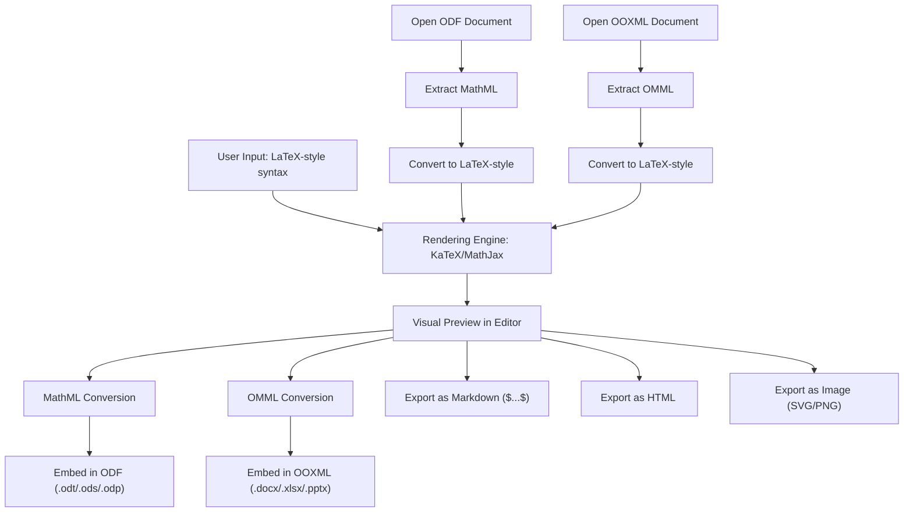

# Papirus Office

## 📘 Application Name
**Papirus Office** – A modular, open-source office suite for Android, based from the LibreOffice, the most powerful open-source office suite, designed to deliver a **PC-level editing experience** on mobile devices while remaining legally compliant, scalable, and community-driven.

---

## 📝 Short Description
Papirus Office is a mobile-first port of LibreOffice, architected with a modular design and powered by Material 3 Expressive UI. It aims to bring the **full power of desktop-class office editing** to smartphones and tablets, with a focus on **legal compliance, performance optimization, and user empowerment**.  

---

## 📊 Current Status
- **Phase 1**: Environment setup ✅  
- **Phase 2**: JNI implementation & stress test stage 1 ✅
- **Phase 3**: Building LibreOffice core engine & stress test stage 2 🔜  
- **Phase 4**: Core editing & UI implementation (Material 3 Expressive) – *in progress*  
- **Phase 5**: ARM optimization – *planned*  
- **Phase 6**: Low-end device testing – *planned*  
- **Phase 7**: Adding PC-level features gradually – *planned*

This readme file will be used for development purpose.

---

## 🔗 Links used:
- LibreOffice Gerrit:
  - Main repo: https://gerrit.libreoffice.org/
  - Alternative: https://github.com/LibreOffice/core
- Collabora Online GitHub: https://github.com/CollaboraOnline/online
- HarfBuzz: https://github.com/harfbuzz/harfbuzz
- Microsoft OpenXML SDK Documentation: https://learn.microsoft.com/en-us/office/open-xml/open-xml-sdk
- OpenXML SDK Repository: https://github.com/dotnet/Open-XML-SDK
- ECMA-376 OOXML Specifications: https://ecma-international.org/publications-and-standards/standards/ecma-376/
- ZIP Container Handler (Open Packaging Conventions): https://github.com/kuba--/zip
- TinyXML Parser: https://github.com/leethomason/tinyxml2
- Material 3 Expressive Documentation: https://m3.material.io/
- Roboto Flex Font Repository: https://github.com/googlefonts/roboto-flex
- Material Symbols Repository: https://github.com/google/material-design-icons
- All repository links for creating equation syntax:
  - KaTeX: https://github.com/KaTeX/KaTeX
  - MathJax: https://github.com/mathjax/MathJax
  - LaTeXML: https://github.com/brucemiller/LaTeXML
- Mermaid Syntax Repository: https://github.com/mermaid-js/mermaid
- ScanIt: https://github.com/mishraaditya595/ScanIt
- ZXing: https://github.com/zxing/zxing
- ZBar: https://github.com/ZBar/ZBar
- All Android integration samples: https://developer.android.com/samples
- BibTeX Parser:
  - Main website: https://pypi.org/project/bibtexparser/
  - GitHub page: https://github.com/sciunto-org/python-bibtexparser
  - Documentation: https://bibtexparser.readthedocs.io
- Ink drawing support
  - API documentation: https://developer.android.com/develop/ui/views/touch-and-input/stylus-input/about-ink-api
  - Source code: https://github.com/google/ink

---

## 🧮 Modular Equation Parser Flow

Papirus Office uses a modular equation handling system to ensure compatibility across platforms and formats.  
The core input method is **LaTeX-style syntax**, rendered via **KaTeX/MathJax**, and converted to appropriate markup formats for document storage.

---

### 1. Equation Input (User-Facing)
- **Input format**: LaTeX-style syntax  
  Example: `\frac{a}{b} + \sqrt{x}`  
- **Editor modules**: Writer, Calc, Impress  
- **Rendering engine**: KaTeX or MathJax (lightweight, fast, mobile-friendly)

### 2. Internal Conversion Pipeline
- From User Input → Rendered Equation
  LaTeX-style input → KaTeX/MathJax → Visual preview
- From Rendered Equation → Document Format
  Depending on the target format:
  - ODF (OpenDocument Format)
    LaTeX-style input → Convert to MathML → Embed in ODF (.odt, .ods, .odp)
  - OOXML (Microsoft Office Format)
    LaTeX-style input → Convert to OMML → Embed in DOCX, XLSX, PPTX

### 3. Equation Extraction (Opening Existing Documents)
- ODF
  Extract MathML → Convert to LaTeX-style → Display in Equation Editor
- OOXML
  Extract OMML → Convert to LaTeX-style → Display in Equation Editor

### 4. Equation Saving (Exporting Documents)
- **ODF**: Save equations as MathML blocks  
- **OOXML**: Save equations as OMML blocks  
- **Other formats** (optional):  
  - Markdown → `$...$` or `$$...$$`  
  - HTML → `<math>` (MathML)  
  - Image → SVG/PNG (rendered snapshot)

### 5. Notes & Recommendations
- **KaTeX/MathJax** are used only for rendering; not stored in final document.  
- **MathML** is the preferred format for ODF compatibility.  
- **OMML** is required for full Microsoft Office compatibility.  
- **LaTeX-style input** ensures user familiarity and cross-platform flexibility.  
- Conversion modules should be **modular and toggleable** via build flags:
  - `ENABLE_MATHML_SUPPORT`
  - `ENABLE_OMML_SUPPORT`

### 6. Summary Table
| Scenario                         | Recommended Markup Format  | Notes                                |
|----------------------------------|----------------------------|--------------------------------------|
| ODF (open/save)                  | **MathML**                 | LibreOffice native format            |
| In-app editing (Papirus)      | **LaTeX-style input**      | User-friendly, KaTeX-compatible      |
| OOXML (open/save)                | **OMML**                   | Required for MS Office compatibility |

---
## 🧮 Modular Equation Parser Flow (Mermaid Diagram)

    
---

## 🚀 Roadmap
### 📦 LibreOffice Core Integration & OOXML Compatibility Foundation (Phase 3)
This phase consists of five sequential tasks designed to establish a stable LibreOffice core and prepare for robust OOXML interoperability.

#### ✅ Task 1: Integrate LibreOffice Core Engine (C++)
- Integrate the LibreOffice core engine into the Papirus Office runtime.
- Ensure successful JNI bridging and modular encapsulation of Writer, Calc, and Impress components. Use source code from [Collabora Office](https://github.com/CollaboraOnline/online) as reference.
- Focus on stability, memory safety, and performance on mobile devices.

#### ✅ Task 2: Real-World Document Parsing & Rendering (Stress Test Stage 2)
- Use the attached real-world documents. Test files included:
  - `sample.docx` – TOC, images, headers/footers
  - `sample.xlsx` – PivotTables, formulas, charts
  - `sample.pptx` – 51 slides with transitions and images
- Test parsing, layout fidelity, and rendering accuracy across all three modules.
- Target device profile: **ARMv7, 2GB RAM**
- Log performance metrics, rendering issues, and crash reports.
- Document opens without crash, layout fidelity ≥ 80% compared to MS Office

#### ✅ Task 3: OOXML Compatibility Foundation (Standards & SDK Reference)
- Study and reference the following official resources:
  - [Microsoft Open XML SDK Documentation](https://learn.microsoft.com/en-us/office/open-xml/open-xml-sdk)
  - [Open XML SDK Source Code (GitHub)](https://github.com/dotnet/Open-XML-SDK)
  - [ECMA-376 OOXML Specification (All Parts)](https://ecma-international.org/publications-and-standards/standards/ecma-376/)
- Use these resources to understand the structure of:
  - WordprocessingML (DOCX)
  - SpreadsheetML (XLSX)
  - PresentationML (PPTX)
  - OMML (Office Math Markup Language)

#### ✅ Task 4: C++ Implementation of OOXML Compatibility Layer
- Implement a modular C++ engine capable of reading and writing OOXML documents.
- Required components:
  - ZIP container handler (Open Packaging Conventions)
  - XML parser for WordprocessingML, SpreadsheetML, PresentationML
  - OMML parser for equations
  - Compatibility fallback handler for unknown or unsupported elements
- Ensure the engine is modular and can be toggled via **build flags** or plugin architecture. Build flag suggestion:
  - `ENABLE_OOXML_SUPPORT` – toggles OOXML compatibility layer
  - `ENABLE_OMML_PARSER` – toggles equation parser for OMML
- Engine must be tested with both strict and transitional OOXML documents
- Make sure to avoid any possible conflicts with OOXML integration provided with LibreOffice source code to prevent errors

#### ✅ Task 5: Reverse Engineering & Behavioral Testing
- Perform behavioral testing by comparing rendering results with Microsoft Office (desktop or web).
- Focus on:
  - Layout fidelity (margins, fonts, spacing, object positioning)
  - Feature parity (charts, tables, transitions, equations)
  - Compatibility with real-world documents
- Log discrepancies and propose compatibility patches or fallback strategies.
- Do not use proprietary source code from OnlyOffice or other closed-source projects.
- All reverse engineering must be based on publicly available specifications and behavioral testing only.
- Behavioral mimicry is permitted based on document structure and output comparison.

This phase lays the groundwork for full document interoperability and ensures that Papirus Office can serve users transitioning from Microsoft Office with minimal friction.

---

### 🔹 Upcoming UI/UX Implementation (Phase 4)
#### 🎨 Material 3 Aesthetics
- **Font**: Roboto Flex (Google Fonts)  
- **Icons**: Material Symbols (fallback to LibreOffice Colibre icons if unavailable)  
- Unified expressive design across toolbars, dialogs, and sidebars

#### 🛠️ Toolbars (mobile)
- **Default toolbars**: Standard + Formatting (+ Sheet toolbar in Calc)
  - Includes two persistent buttons on the right side of the standard toolbar: Show/hide keyboard and open ribbon drop-down bar.
- **Contextual toolbars**: Appear only when relevant (Table, Image, Shape/Object)  
- **For formatting toolbar**: Adjusted adaptively based on selected objects (text, table, object, etc.)  
- **Overflow handling**:  
  - If >3 toolbars (mobile) or >4 in Calc → persistent drop-down button for switching  
  - Swipe vertical gesture to switch toolbars; swipe horizontal for scrolling
- All of these toolbars can be scrolled horizontally to include all options available on each toolbar

##### 🎀 Simplified ribbon bar (mobile)
- UI design & layout inspired from M365 Copilot/Word/Excel/PowerPoint app for Android to give mobile users same experience.
- Can be invoked by tapping on "Open simplified ribbon bar" icon.
  - This action will also hide all toolbars.
  - Closing the simplified ribbon bar will showing these toolbars again.
- Header layout of this bar include: `Ribbon options (with inverted triangle icon)` on the left and three buttons `Undo | Redo | Hide simplified ribbon bar` on the right.
  - Tapping on `Ribbon options` will show all ribbon options in one drop-down menu:
    - File
    - Home
    - Insert
    - Design (Impress only)
    - Layout (Writer & Calc only)
    - Formula (Calc only)
    - Data (Calc only)
    - Review (Writer & Calc Only)
    - Transition (Impress only)
    - Animation (Impress only)
    - Slide show (Impress only)
    - View
    - Drawing (visible only when editing document in drawing mode)
    - Object (visible when editing any object)
    - Picture (visible when editing picture object)
    - Table (visible when editing table object)
    - Fontwork (visible when editing Fontwork object)
    - PivotTable (visible when editing PivotTable object, Calc only)
    - Chart (visible when editing chart object)
- All options in each Ribbon options are arranged in a horizontal list or grid layout dynamically.
  
#### 🎀 Ribbon full view (tablet)
- **Use full ribbon tab bar experience** like in M365 Copilot:
  - Ribbon can be minimized by double tapping on one of its tab or by clicking "^ Hide ribbon" on the far right side of the ribbon.
  - Tabs included:
    - File
    - Home
    - Insert
    - Design (Impress only)
    - Layout (Writer & Calc only)
    - Formula (Calc only)
    - Data (Calc only)
    - Review (Writer & Calc Only)
    - Transition (Impress only)
    - Animation (Impress only)
    - Slide show (Impress only)
    - View
    - Drawing (visible only when editing document in drawing mode)
    - Object (visible when editing any object)
    - Picture (visible when editing picture object)
    - Table (visible when editing table object)
    - Fontwork (visible when editing Fontwork object)
    - PivotTable (visible when editing PivotTable object, Calc only)
    - Chart (visible when editing chart object)

#### 📊 PivotTable Bar (Calc)
- On mobile, this bar will be displayed at the bottom like Ribbon drop-down bar.
- On tablet, this bar will be displayed as sidebar on the left/right side.

#### 🌟 Animations bar (Impress)
- Same as PivotTable bar above, with an addition of animation timeline with Material 3 Expressive UI style

#### 🧮 Floating Contextual Toolbar (FCT)
- This bar will be displayed on top of selected text, cell, or objects.
- Rightmost icon always opens full contextual menu (desktop-like right-click options) under the name `More options`
- **Calc**:  
  - Single cell/range: Cut, Copy, Paste, Delete, Comment, Fill mode, Multi-selection, More options  
  - Multi-range: Clear selection, Delete, Comment, Fill mode, More options (Cut/Copy/Paste hidden)  
- **Writer/Impress**:
  - Normal text: Cut, Copy, Paste, Delete, More options
  - Chart: Cut, Copy, Paste, Delete, Edit data, More options  
  - Text with spelling/grammar error: Suggestions, Delete, Ignore, More options (Cut/Copy/Paste hidden)
  - Table: Cut, Copy, Paste, Insert (Columns, rows), Delete (Columns, rows, table), Table settings, More options.
- **All modules (objects)**: AI options (if enabled), Cut, Copy, Paste, Duplicate, Delete, Add text, Properties
- **Visual grouping**: Thin separators between option groups  
- **Gestures**:  
  - Tap once (Calc cell) / double-tap (text/objects) → show FCT  
  - Long-press → open context menu  

#### 📂 Quick Access Toolbar (QAT)
- **Mobile**: Up to 3 icons visible; overflow menu (inverted triangle icon) for extras  
- **Tablet**: Default 7 icons, expandable to 10; overflow menu (inverted triangle icon) for >10 icons  
- **Tooltips**: Long-press any icon shows tooltip  

#### 🔍 Find & Replace
- **Mobile**: Replaces Title bar with scrollable toolbar; persistent icons for More options & Exit  
- **Tablet**: Full toolbar below Ribbon full view bar  

#### 🪟 Dialogs & Sidebars
- **Mobile**: Full-page dialogs with header layout:  
  - `← Back | Title` (left), `Apply/OK/Set | ⋮ More options` (right)
  - Preview shown at top if available  
- **Tablet**: Sidebar dialogs with header:  
  - `Title` (left), ` ⋮ More options | × Close` (right)
  - Footer buttons (Apply, OK/Set, Cancel) shown dynamically  
  - Papirus Options (based on LibreOffice Options) → full-page dual-column (Android Settings style)

#### 🧠 Multi-Selection
- **Writer**: Use LibreOffice Writer's Text Selection Mode → swipe non-contiguous text  
- **Calc**: Multi-range selection via FCT  
- **All modules**: Object Mode → select multiple objects by tap or drag  
- **Feedback**:  
  - Mobile: persistent info bar/snackbar  
  - Calc: information bar (Sum, Avg, Count, etc.)  
  - Tablet: status bar  

#### 🎞️ Global Transitions
- Slide-in animations for all UI elements  
- Predictive back gesture support  

---

### 🔹 Upcoming Feature Implementation (Phase 7)
#### 🧩 General Features (All Modules)
- Start Center → Compose UI + SAF / Android Documents UI  
- Localization → LibreOffice core + English fallback  
- RTL & complex scripts → HarfBuzz
- Asian typography scripts support
- Spell check → Hunspell + LanguageTool (extra languages downloadable)  
- Font management → Google Fonts (on-demand) + `/storage/emulated/0/Fonts`
  - Option to include system fonts in font list.
  - If requested font not available, fallback to system default font or Noto Sans/Serif/Mono
- Speech-to-Text → Android API  
- Text-to-Speech (TTS) → Android TTS API  
- Sharing → Android Share Sheet  
- Undo/redo  
- Auto-correct & auto-capitalization  
- Hyperlink insertion  
- Image insertion (JPG, JPEG, GIF, PNG, SVG, WEBP, TIFF)
  - Support for inserting AI-generated image via optional AI integration feature
- Insert picture from Camera → via Android Intent  
- Text direction (LTR/RTL)  
- Slide show mode → fullscreen Activity (Impress)
- Export documents → PDF, HTML, Markdown, ePub
- Stylus ink drawing → stored as PNG images
- Shape insertion → available in Writer, Calc, Impress (subset of Draw module)
- Report bug feature → to report incoming crash via notification or to open an issue in Papirus's GitHub issues page
- About app page (on Papirus Options) must include all license terms from all source code used in this project.

---

#### 🟢 Basic Features
✍️ **Writer**
- Full basic text formatting features: bold, italic, underline, strikethrough, etc. 
- Alignment: left, center, right, justify  
- Bullet & numbered lists  
- Full page/paragraph styles & formatting features (heading, paragraph, character, etc.)
  - Advanced page formatting: page borders, watermark (with custom watermark support)
  - Advanced paragraph formatting: Drop cap, default & custom tab width
- Additional `Tab` icon option on the leftmost of the Standard toolbar to insert tab (in mobile)
- Table insertion & basic table formatting  
- Page layout: margins, orientation, size, etc.
- Header & footer  
- Page numbering  
- Find & replace

📊 **Calc**
- Full cell formatting: Number, Alignment, Font, Borders, Shading (pattern + color), Protection, Asian Typography. 
- Cell/range references: relative & absolute
  - To change the cell reference:
    - Tap on the highlighted cell/range
    - Choose the `Reference type` option
    - Choose between `A1` (all relative), `$A1` (absolute in column), `A$1` (absolute in row), or `$A$1` (all absolute)
  - Alternative method: Use F4 key (when the app is detected that a hardware keyboard is connected) to change the reference
- Automatically highlighting cell/range references when typing any formula/function with different colors
  - Tapping on the highlighted cell/range will open the 2-options Floating Contextual Toolbar (FCT):
    - `Edit`: to edit the cell/range reference
    - `Reference type`: to change it's reference type (see above)
- Sheet navigation & multiple sheets
  - For navigating the sheet in mobile:
    - Add the `Sheet tab` icon option on the leftmost of the Standard toolbar for easier access
    - When this option is clicked, the Formula toolbar will be replaced with the Sheet toolbar
    - Tapping the `Sheet tab` icon again when the Sheet toolbar is active will replacing back the Sheet toolbar with the Formula toolbar
- Cell navigation in mobile:
  - Add two additional button on the leftmost of the Standard toolbar (at the left side of the `Show/hide Sheet Toolbar` option described above):
    - `←` (Previous cell; equivalent by pressing `Shift`+`Tab` on the keyboard)
    - `→` (Next cell; equivalent by pressing `Tab` on the keyboard)
- Sorting & filtering  
- Freeze rows/columns  
- Cell merging  
- Conditional formatting (basic rules)
  - Support for adding custom conditional formatting rules
- Data validation (dropdown lists)  
- Basic charts: bar, line, pie  
- Full Calc formula support (500+ functions, integrated from LibreOffice source code)
  - Added `LibreOffice unique formulas` category for unique LibreOffice-only formulas.

🎞️ **Impress**
- Slide creation & layout templates  
- Text formatting & bullet lists  
- Basic slide transitions  

---

#### 🟡 Intermediate Features
- Equation editor → LibreOffice Math with MathML (opening and saving in ODF document format), Latex-style (in-app editing, with KaTeX compatibility), and OMML (opening and saving in OOXML document format) input.
  - See: Modular Equation Parser Flow (above) for conversion logic.
- Diagrams/Infographics → Mermaid.js  
  - Rendered as SVG/PNG images  
  - Mermaid syntax stored as linked comments  
  - Compatible with ODF and OOXML  
- PDF viewer + editor → LibreOffice Draw subset (basic editing)  
- Bibliography → SQLite/dBASE + BibTeX parser
  - BibTeX parser will map entries to SQLite schema (Author, Title, Year, Publisher, etc.)
- Document scanner → Scanit source code  
  - Export to DOCX, ODT, XLSX, ODS, PDF, Image  
- Font directory override → support for custom font directories beyond `/storage/emulated/0/Fonts`  
- Font download relocation → downloaded fonts from Google Fonts server redirected to `/storage/emulated/0/Fonts`  
- Font migration (retroactive) → older fonts moved to `/storage/emulated/0/Fonts` if relocation enabled  
- Slide sorter → Grid Compose (Impress)  
- Media embedding → Android Photo Picker + Media API (Impress)  
- Data import → TXT, CSV, SQLite, dBASE → converted to XLSX/ODS  
- QR code generator & scanner → ZXing + ZBar  
- Table of Contents & References → Writer (via style tagging + index generator)  
- Master Pages (Writer) & Master Slides (Impress) → full global layout support  
- Insert Image into cell (Calc) → experimental, limited via cell anchoring  
- Insert Chart (Writer & Impress) → via two available formats: Calc's basic subset module or Mermaid syntax
  - If Insert Chart via Calc is selected:
    - A full-page dialog of Calc spreadsheet is displayed, with all basic subset features.
    - After creating the data via this spreadsheet and save it, the spreadsheet will be automatically closed and the chart based on this data is created and displayed in the document.
    - User can edit the chart's data at any time by tapping on the chart object → `Edit data` (via FCT)
    - Additional chart settings can be accessed by tapping one of the chart elements (double tap to select a single value within a data series) → Simplified ribbon options `Chart` → `Edit chart element`
    - User can also convert the chart's data to Mermaid syntax format by tapping on the chart element → `More options` → `Convert to Mermaid`, or by tap and hold → `Convert to Mermaid`.
  - If Insert Chart via Mermaid is selected:
    - On mobile, the Simplified ribbon bar is replaced by the text box bar, where user can enter the mermaid syntax here.
    - On tablet, a text box sidebar displayed on the side of the app window.
    - The chart created using mermaid syntax format will be valid if the type of mermaid syntax diagram entered is appropriate. Otherwise the app will display the error box.
    - After creating the data via this syntax and save it, the bar (mobile)/sidebar (tablet) will be automatically closed and the chart based on this data is created and displayed in the document.
    - The chart created via this method will be displayed as image with it's mermaid syntax embedded as comment on the image.
    - User can edit the chart's data at any time by tapping on the chart object → `Edit data` (via FCT)
    - Option to edit the chart created with this format is not available because all the data (including it's elements) can only be added via the option `Edit data` above using mermaid syntax.
    - User can also convert the chart's data to Calc spreadsheet format by tapping on the chart element → `More options` → `Convert to spreadsheet`, or by tap and hold → `Convert to spreadsheet`.
  - The chart can be exported to device as image format (via tap on chart → `More options` → `Save as picture`, or tap and hold on the chart → `Save as picture`)
- Insert Table (Impress) → full support like Writer

---

#### 🟠 Advanced Features
- Advanced charting → LibreOffice Calc + hardware acceleration (scatter, radar, bubble)  
- 3D charts & visualization → LibreOffice Calc + hardware acceleration (subset port)  
- Custom animations → Compose + hardware acceleration (basic animations)  
- 3D transitions → Compose + hardware acceleration (cube, flip, rotate)  
- Presenter console → Chromecast / HDMI (split-screen presentation)  
- Remote control → Android Wear integration
- Track changes → Sidebar Compose  
- Picture styles/effects → Android Image Filter API  
- Diagonal borders → manual rendering (Compose)  

---

#### 🔴 Expert Features (External Integration)
- Advanced media editing → Android Intent (“Complete action using”) → redirect to external apps  
- Optional AI Integration (Google Gemini) →  
  - Disabled by default, can be enabled in app settings  
  - Once enabled:  
    - User provides API key from Google AI Studio  
    - Direct link to Google AI Studio provided for key retrieval  
    - Configuration stored locally, only used when AI features are invoked
  - Ability to choose between any models (2.5 flash, 2.5 pro, etc.)
    - Auto switch to Nano Banana model to insert AI-generated image

---

## 🤝 Contributing
Contributions are welcome! Please open issues or pull requests for bug reports, feature requests, or improvements.

---

## 📜 License
Papirus Office follows the same license as LibreOffice (MPLv2/GPLv3/LGPLv3 tri-license).

---

## ✅ Summary
Papirus Office is progressing through a **phased roadmap**:  
- **Phase 3**: Core engine build (foundation)  
- **Phase 4**: Material 3 UI/UX implementation (in progress)  
- **Phase 7**: Gradual rollout of PC-level features and AI integration  

The goal is to deliver a **sustainable, ethical, and powerful open-source office suite** that empowers users on both mobile and tablet platforms.